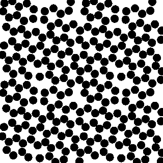

# Patchy 2d

Simulation software to simulate patchy particles in 2d.

Usage: patchy2d
[-n] [--name] {name:} Name
[-s] [--step] {step:} Number of MC steps
[-N] [--specie] {specie:} Species
[--new_sigma] {(null)} Update sigma
[--new_width] {(null)} Update width
[--new_mu] {(null)} Update mu
[--new_angle] {(null)} Update angles
[-b] [--box] {box:} Simulation box lengths x and y
[-c] [--copy] {copy:} Copy the simulation box in x and y direction
[-e] [--epsilon] {epsilon:} epsilon -- interaction strength
[--end_epsilon] {end_epsilon:} end epsilon -- final interaction strength
[-p] [--pressure] {pressure:} pressure
[-l] [--lambda] {lambda:} lambda
[-L] [--lambda_coupling] {lambda_coupling:} lambda coupling
[--uy] {uy:} uy -- box tilt
[--max_move] {maximum_displacement:} Maximum displacement
[--max_rot] {maximum_rotation:} Maximum rotation
[--max_vol] {maximum_volume:} Maximum volume change
[--max_uy] {maximum_shape:} Maximum shape change
[--max_dsigma] {maximum_dsigma:} Maximum dsigma
[-m] [--mod] {mod:} Write modulus
[--pmod] {pmod:} Print modulus
[-o] [--optimize] {optimize:} Step size optimization on/off
[-v] [--verbose] {verbose:} Verbose mode on/off
[--snapshot] {snapshot:} Snapshot mode on/off
[--seed] {seed:} Seed
